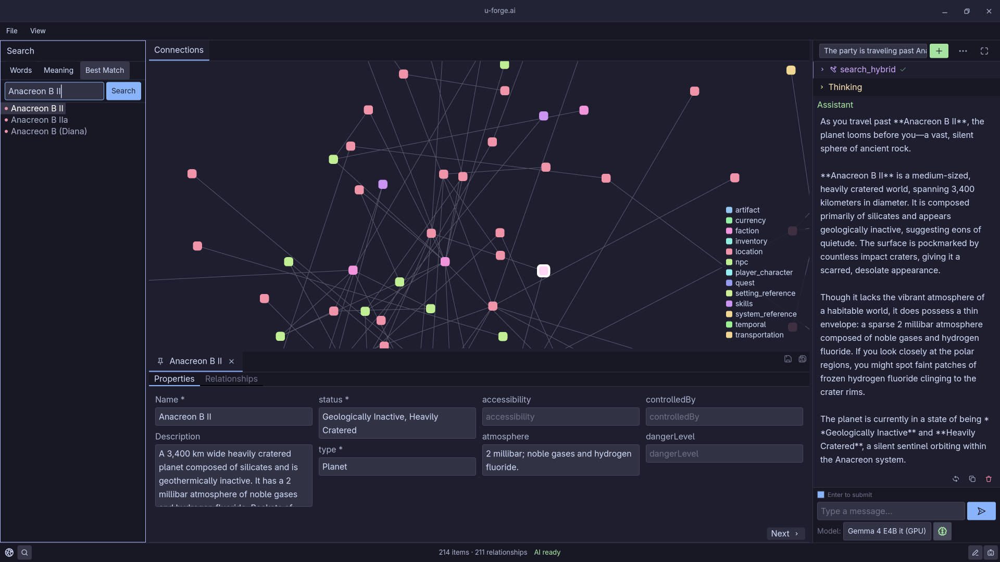

I've been building **u-forge.ai (Universe Forge)** since 2024 to help game masters organize and develop their tabletop RPG settings. It's a Rust desktop application that connects campaign notes through a knowledge graph, with search and an optional AI assistant for working with world lore.

As of September 2026, the project is at v0.1.1 alpha for Linux x86_64. Code, setup instructions, and releases are available on [GitHub](https://github.com/th3raid0r/u-forge.ai).

*The workspace combines search, a relationship graph, object editing, and the AI assistant.*

## From campaign notes to a connected world

Characters belong to factions, locations have histories, and events connect people and places. I wanted those relationships to be easy to follow as a setting grows.

Universe Forge stores world content as objects and relationships with schema-defined properties. The World Canvas lets you explore those connections alongside notes and an editable details view. SQLite keeps world data, text chunks, schemas, and saved canvas positions on your machine.

I kept editing, graph navigation, import/export, and full-text search independent of the AI backend, so the workspace stays useful when inference is unavailable.

## Hybrid retrieval and GraphRAG

The assistant needs to find relevant lore across both structured objects and freeform notes. I built a retrieval system that uses the knowledge graph to provide that context, an approach known as GraphRAG. Search combines three methods:

- **Keyword search** uses SQLite FTS5 to find names, phrases, and exact terms.
- **Semantic search** uses embeddings and sqlite-vec to find conceptually related material.
- **Hybrid search** combines both sets of results using reciprocal rank fusion, with optional reranking.

The graph preserves the relationships around each note, giving the assistant context from the setting. One design goal is to keep returning useful results from available search methods when another method fails.

## Keeping AI updates consistent with world data

The assistant uses Rig, with tools for search and for updating nodes and relationships. The application validates tool arguments against JSON Schema to catch malformed requests before they change stored world data.

JSONL imports follow the same schema rules. They resolve nodes first, then relationships, and report invalid records or connections that are missing or ambiguous. These checks help keep data consistent; reviewing the lore itself remains part of the creative process.

## Running inference on consumer hardware

Local models share memory and compute with the rest of the desktop. I built inference queues to schedule work across the NPU, CPU, and GPU resources supported by the configured backend, models, drivers, and hardware. The aim is to balance throughput and latency within those limits.

Jobs support cancellation and report distinct failure and timeout outcomes. Queue telemetry, adaptive scheduling for embeddings, and limits on model context help manage these workloads. A circuit breaker stops repeated tool calls.

[Lemonade](https://github.com/lemonade-sdk/lemonade) handles local inference discovery, model selection, and a private runtime on Linux. You can also configure a separately managed endpoint. Choosing a remote endpoint sends inference requests to that service.

My [September 2025 CachyOS and Strix Halo guide](/posts/strixhalo-cachyos/) covers the Linux inference setup I explored along the way.

## Architecture and delivery

| Concern | Implementation |
| --- | --- |
| Desktop application | Rust 2024 multi-crate workspace; native GPUI interface through gpui-ce |
| World data | SQLite, schema-driven objects and relationships, validated JSONL ingestion |
| Retrieval | FTS5, sqlite-vec, reciprocal rank fusion, optional reranking |
| Assistant | Rig, schema-validated tools, optional Lemonade inference |
| Runtime reliability | Tokio, cancellation, bounded model context, typed outcomes and telemetry |
| Distribution | Linux x86_64 AppImage packaging and GitHub Actions release workflow |

The packaging workflow includes application defaults and a private Lemonade runtime. Runtime provisioning uses SHA-256 verification to check downloads.

## Bringing SRE experience to the desktop

At Aerospike, I work on alerting, incident response, and automation for cloud services. Building Universe Forge has given me a different setting for the same practical questions: what happens when a dependency fails, how does work stop when it's cancelled, and how can someone understand what went wrong?

Those questions shape the inference queues, data validation, and packaging. They also guide what I look for as I test the application and refine retrieval quality.

## What's next

My immediate focus is search relevance and retrieval precision. Longer-term plans include richer schema icons, improved chunking and embeddings, a dedicated timeline, geographic maps, session transcription, and rules ingestion.

For setup and ongoing development, see the [README](https://github.com/th3raid0r/u-forge.ai#readme), [architecture documentation](https://github.com/th3raid0r/u-forge.ai/blob/main/ARCHITECTURE.md), and [compatibility notes](https://github.com/th3raid0r/u-forge.ai/blob/main/COMPAT.md).
